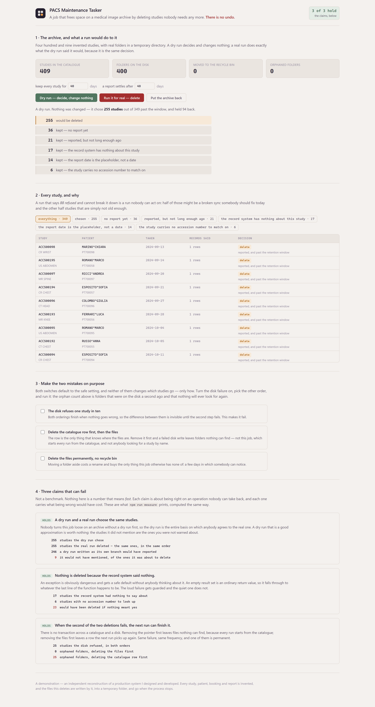
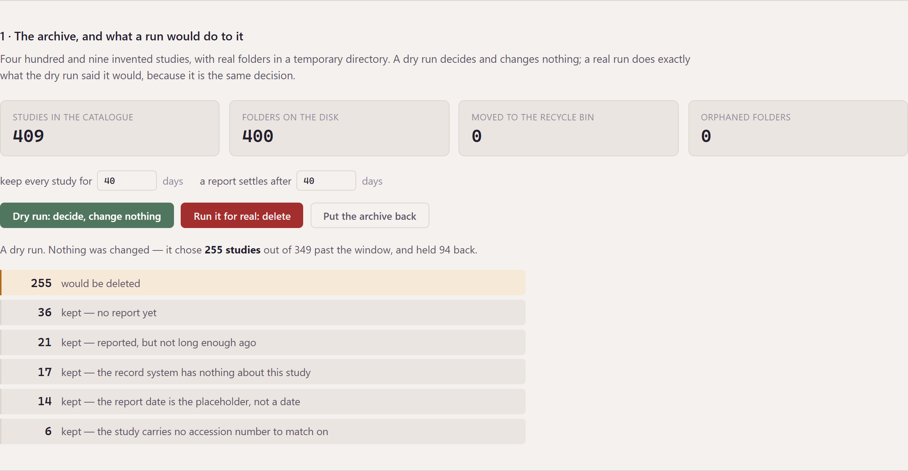
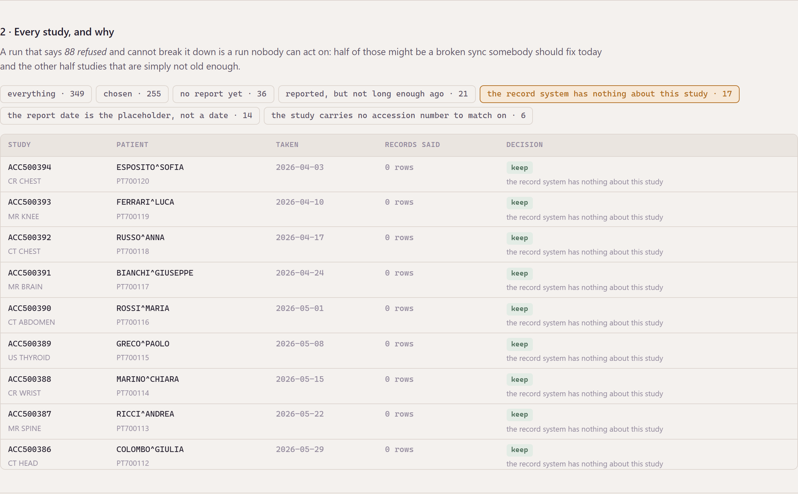
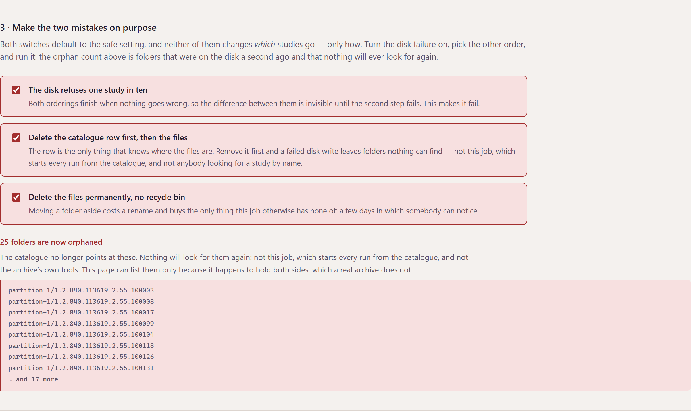
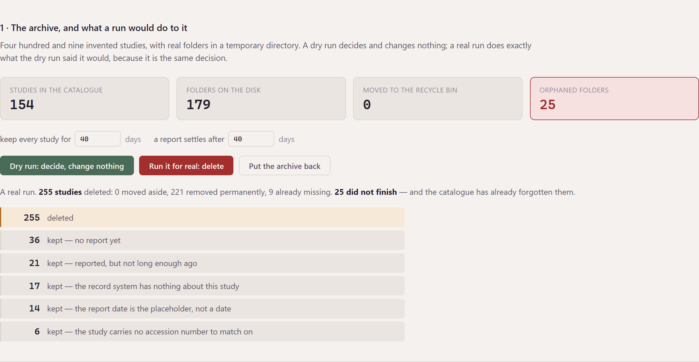
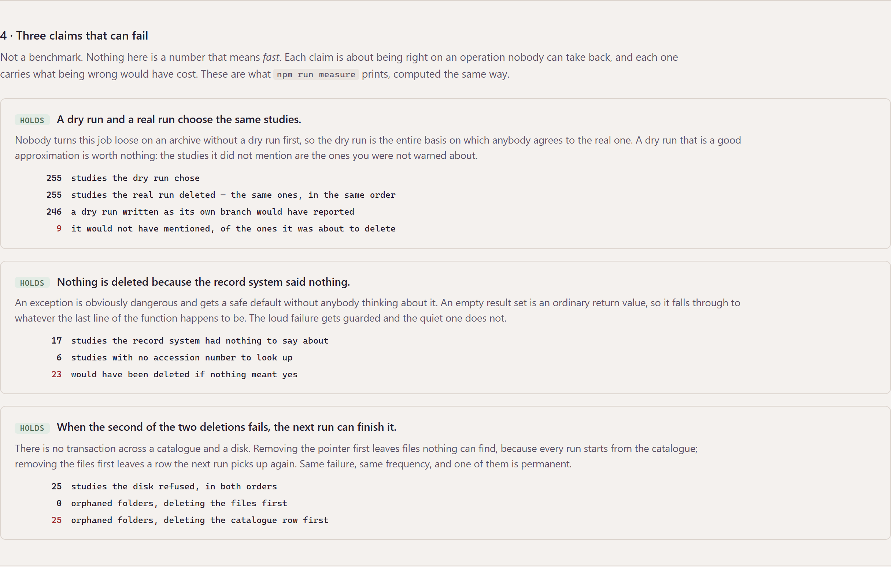

# PACS Maintenance Tasker

A medical image archive fills up. Somebody writes a job that deletes the studies
nobody needs any more, points it at the archive, and goes home.

**There is no undo.** Not for the files, and not for the row that said where the
files were. A study is a folder of a few hundred slices and one line in a
catalogue, and once both are gone there is nothing left to notice with. That is
the entire subject of this repository: not how to delete things, which is one
line, but **what has to be true first**, and how you find out whether you were
right about it.

It comes with three claims, and each of them can fail:

| | |
| --- | --- |
| **A dry run and a real run choose the same studies.** | Written as its own branch, the dry run would not have mentioned **9** of the 255 it was about to delete. |
| **Nothing is deleted because the record system said nothing.** | With "nothing means yes", **23** patients' studies go — on a run where nothing errors. |
| **When the second of the two deletions fails, the next run can finish it.** | The other order leaves **25** folders that nothing will ever look for again. |

`npm run measure` prints those and exits non-zero if any of them stops being
true. So does CI.



---

## Before you start

**Node 24 or newer**, and nothing else.

```
node --version        # v24.19.0 here; anything 24.x or above will do
```

Node 24 because both stores are [`node:sqlite`](https://nodejs.org/api/sqlite.html),
which is in the runtime and unflagged from 24. That is the whole reason for the
floor. CI runs the tests on 24 and on 25, so the claim is checked rather than
asserted.

**No external services.** No database to install, no archive to point at, no
API key, no network access after `npm install`.

**It deletes real files, and only its own.** Every study, patient, booking and
report is invented in `src/measure/corpus.js`. The folders are written by this
job into a fresh directory under your system temporary folder, and the store
refuses any path that is not under that directory — checked in
[`src/files/store.js`](src/files/store.js), before touching the disk, because the
catalogue computes its paths by joining three columns and one wrong row would
otherwise point this at somewhere else entirely.

**One dependency, and only for the checks.** `playwright-core` is a
`devDependency` used by `npm run check:screen` and `npm run screenshots`, which
drive a real browser. About 2 MB. It looks for Edge, then Chrome, then Chromium,
and **says which one it got**; `--channel <name>` picks one. If none is there,
those two commands exit **2** and say so — neither passing nor failing, because
a check that did not run is not a check that passed.

**Disk and network.** `npm install` fetches one package: about 2 MB downloaded,
5 MB on disk with `node_modules`. A run writes about 400 folders of six small
files into the temporary directory and removes them again.

**To put the machine back:** delete the folder. Nothing is installed globally,
no service is registered, no port is held after the process stops, and the
scratch directory goes when the process does.

---

## Running it

```
git clone https://github.com/riccardosapuppo/pacs-maintenance-tasker.git
cd pacs-maintenance-tasker
npm install
npm start
```

`npm start` serves the console on `127.0.0.1:4100` **and opens it in your
browser.** `npm start -- --no-open` if you would rather it did not, `--port 4101`
if something already has 4100. It does not open a browser in CI or when nothing
is attached to the terminal.

From the terminal instead:

```
npm run run:dry          decide against the invented archive, change nothing
npm run run:for-real     do it — and it is the same decision
npm run measure          the three claims, and what being wrong would cost
npm test                 38 tests, about thirteen seconds — several of them build archives on disk
npm run check:screen     drives the console in a real browser — 36 checks
npm run check:serving    what the service actually sends — 39 checks
npm run check:mark       the mark in the header and the mark in the tab
npm run screenshots      regenerates every picture in docs/
```

Run `npm run run:dry` and `npm run run:for-real` one after the other and compare
the two reports. They print the same 255 studies and the same 94 refusals,
because they are the same decision — which is the first claim, made where you
can check it rather than asserted in a paragraph.

---

## What it decides, and why



A study may be deleted when the archive has kept it long enough **and** the
record system agrees. That second half is a question asked across a boundary —
a different database, owned by a different product, joined on nothing but an
accession number that both sides happen to write down — and it has three
outcomes, not two:

- **rows came back** — there is something to reason about
- **the question was put and came back empty**
- **the database did not answer**

The whole of [`src/decide/rules.js`](src/decide/rules.js) is a pure function
over those. It reads no database, deletes nothing, and returns a decision with a
reason, because the run has to be able to answer *why* for every study it
touched, and a decision tangled up with the deleting can only be understood by
deleting something.

The reasons are counted, not just totalled. A run that says *94 refused* and
cannot break that down is a run nobody can act on: 36 of those are studies
nobody has reported yet and 17 are a broken sync somebody should fix today, and
those are not the same news.

### Silence is not permission



The rule this project exists to get right.

When the record system returns **nothing** for a study — no booking, no report,
no row at all — that is not it saying "go ahead". Every reason it might say
nothing is a reason to stop: the accession number is written differently on the
two sides, a sync has not run, the study came from somewhere else, the query hit
a replica that is behind, somebody typed the code in by hand.

It is worth being precise about how easy this is to get wrong, because the
mistake is not carelessness. **A `catch` block is obviously dangerous, so it gets
a safe default without anybody having to think about it. An empty result set is
not obviously anything** — it is a perfectly ordinary return value — so it falls
through to whatever the last line of the function happens to be. The loud failure
gets guarded and the quiet one does not.

The rule as it was is kept, next to the real one, as `decideAsItWas`. It is not
dead code: the measurement runs both over the same corpus so that "we fixed a
bug" can be a number instead of a sentence.

---

## The two mistakes, made on purpose



A study is in two places and there is no transaction across them. Whichever is
removed first, the other can fail — and the two leftovers are not equally bad:

- **the catalogue row first** — the row is gone and the files are not. Nothing
  knows they are there. No future run finds them, because every run starts from
  the catalogue. They sit on the disk for ever.
- **the files first** — the files are gone and the row is not. The next run picks
  the same study up, gets *was not there* from the disk, and finishes the job.

One is garbage nothing can find; the other is work that finishes itself. Same
failure, same frequency.

The console has a switch for the ordering, a switch for the recycle bin, and a
switch that makes the disk refuse one study in ten — because without that last
one both orderings finish and the difference between them is invisible. Turn
them on and run it:



Twenty-five folders that were on the disk a second ago and that nothing will
look for again. The page can list them only because it happens to hold both
sides. A real archive does not, which is why they would never be found at all.

---

## The three claims



Not a benchmark. There is no number here that means *fast*. What is measured is
whether the job is right about an operation nobody can take back, and — where it
is right — what being wrong would have cost, in studies.

The corpus is 409 invented studies with real folders, covering every awkward
case: a booking withdrawn, every line withdrawn separately, a booking with two
examinations and one report, a report column that could not be `NULL` and so
holds `1900-01-01`, a study whose files somebody already cleared by hand, a
study with no accession number at all. There is no clock in it and no
randomness, so the numbers are the same on every machine — and a test asserts
that, by checking the source for `Date.now(` and friends.

A test also pins the numbers this README quotes. Change the corpus and it goes
red, which is the arrangement that stops a README slowly becoming fiction.

---

## What it does not do

- **It is not connected to a PACS.** The archive is `node:sqlite` in memory with
  a schema shaped like a real one — a study row, a storage row, a filesystem row,
  joined to work out a path. A real deployment is SQL Server or Postgres
  depending on the build, which is why the original carried two spellings of
  every query; none of that is interesting to demonstrate and all of it needs a
  server.
- **There is no scheduler.** The original ran on a timer and had a second module
  that pushed images to a patient portal within the centre's opening hours and
  sent an SMS. That half is not here: it is a different subject, and this one is
  already about the part that cannot be undone.
- **The recycle bin is a rename, not a policy.** Nothing empties it, nothing ages
  it out, and it is on the same disk — so it buys you a few days to notice and
  no protection at all from the disk itself.
- **Two stores, still no transaction.** Ordering the two deletions well makes
  the failure recoverable; it does not make it atomic. A crash between the two
  steps still leaves a study half gone, and the argument here is only that the
  half you are left with should be the one the next run can finish.
- **The decision is not the only possible decision.** "Every line reported, and
  the report settled for 40 days" is a rule somebody chose. A different clinic
  wants a different one, and the honest claim is narrow: whatever the rule is, it
  should be one function, in the open, that a person can disagree with.
- **409 studies is not a load test.** The corpus is sized to contain every case,
  not to say anything about a million-study archive.

---

## Where things are

```
src/decide/rules.js      may this study go? a pure function, and a reason
src/decide/run.js        look decides; carryOut acts; the flag chooses between
src/archive/catalogue.js the store that owns the pointer
src/records/system.js    the store that owns the authority — and three outcomes
src/files/store.js       real folders, a recycle bin, and a way to make it fail
src/measure/corpus.js    409 invented studies, no clock, no randomness
src/measure/claims.js    the three claims, each able to be false
src/http/api.js          the service: node:http and nothing else
public/                  the console: no framework, no build step
```

---

## About the original

The original was built for a client and lives in a private repository. This is
an independent reimplementation, written from scratch with synthetic data.

That original was a small Node service on the archive's own machine, running two
modules on a timer: this one, and a second that pushed images to a patient portal
and notified the patient. It read its database connection strings encrypted and
shelled out to a separate executable to decrypt them; none of that is here, and
neither is any configuration file from it.

The three claims are all things it did not have, and two of them are things it
got wrong — which is the reason they are worth writing down. The rule about
silence, the ordering of the two deletions, and the dry run being the same code
path as the real one are the three lessons this repository exists to state, and
they were all learned from reading a job that had been running against a real
archive.

---

## Licence

MIT — see [LICENSE](LICENSE).

Developed by Riccardo Sapuppo.
